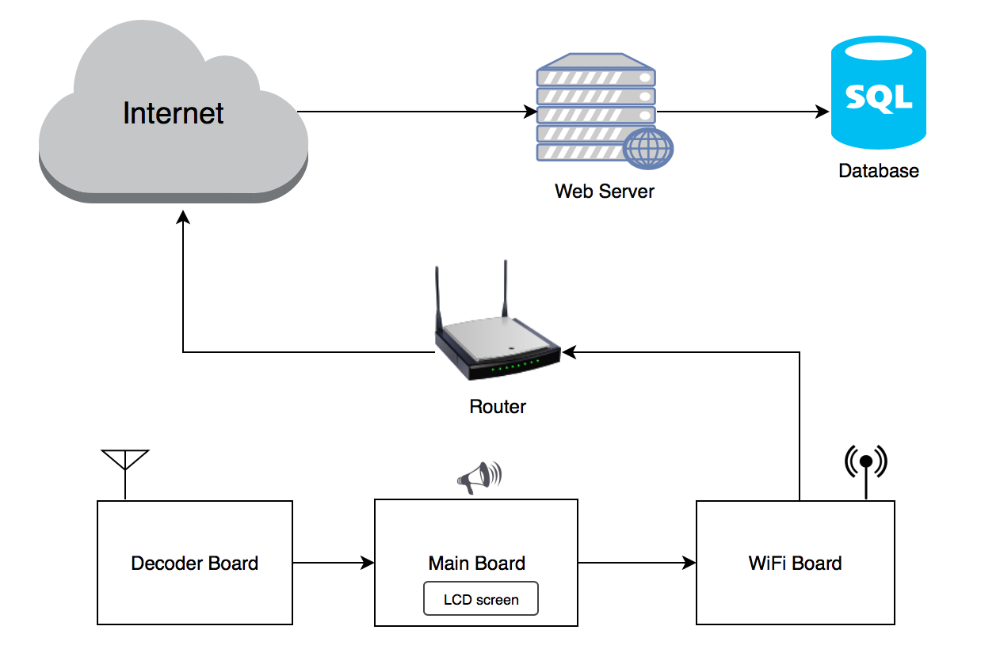

<h1>  PharmaTracker  </h1>

PharmaTracker, our senior design project, consists of multiple parts:  
* __The Decoder board__ consists of a loop antenna resonating with a matched capacitor value, filters, amplifiers, and an ATtiny13 microcontroller to decode the manchester encoded data
* __The Main board__ consists of the LCD screen, buttons, speaker circuitry and ATMEGA644 microcontroller containing the software that implements most of the logic of the system.
* __The WiFi board__ consists of the ESP8266 Wifi module and additional circuitry required to convert the voltages from 5V to 3.3V
* __The web-server__ written in python and its purpose is to accept the connections made by the Wifi module and store them in the database



## Manchester Decoder implementation
To decode the manchester encoded data we need to account for two things:  
*  We need to be able to distinguish between long and short pulses. This can be done either using input capture or fast sampling. Since input capture is not available on the ATtiny13, we decided to use fast sampling. Meaning, we sample faster than the data-rate of the information.
*  We need to somehow achieve synchronization so that we can determine the boundries of each bit period. Since in manchester encoding, 0 is encoded as the transition from high to low, 1 is encoded as the transition from low to high, and the transition occurs in the middle of the bit period, we need a method to find when one period ends and the other period begins.  

##### The following picture shows a small segment from the manchester encoded RFID captured at the input pin of the microcontroller:

As can be seen the length of the long pulses are 500uS and the short ones are 250uS.
### The decoding algorithm 
The algorithm for Manchester decoded is described below in a python-like psudocode
```python

decoded_bitsteam = []
def get_first_manchester():
	while True:
		count = the number of consecutive samples of high or low until a voltage change is detected
		if count >= long_pulse_value:
			break
	decoded_bitsteam.append(current_voltage)

def get_next_manchester():
	current_bit = decoded_bitsteam[-1] # get last element decoded
	count = the number of consecutive samples of high or low until a voltage 
	if count >= long_pulse_value:
		decoded_bitsteam.append(current_bit ^ 1)
	else:
		count_rest = the number of consecutive samples of high or low until a voltage
		assert(count_rest < long_pulse_value) # make sure the next pulse is short as well
		decoded_bitsteam.append(current_bit)
```
It is worth noting that the actual implementation inside the ATtiny13 didn't store the decoded bitsteam as a global array (due to lack of space), and instead we constructed the bytes as we were decoding, and stored the decoded bytes themselves.
